# @phun-ky/speccer


[](http://commitizen.github.io/cz-cli/) [](http://makeapullrequest.com) [](http://semver.org/spec/v2.0.0.html)       [](https://codecov.io/gh/phun-ky/speccer) [](https://github.com/phun-ky/speccer/actions/workflows/check.yml)

## About

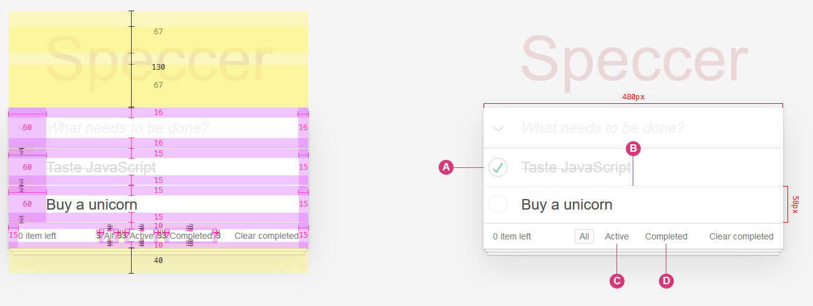

**SPECCER** was originally created to simplify documenting components in a design system, but it can be used to highlight any HTML element on a webpage. If you need to draw attention to elements, **SPECCER** is your tool!

## Table of Contents<!-- omit from toc -->

- [@phun-ky/speccer](#phun-kyspeccer)
  - [About](#about)
  - [Installation](#installation)
  - [API](#api)
  - [Usage](#usage)
    - [Typescript](#typescript)
    - [ESM](#esm)
    - [Script](#script)
    - [React](#react)
  - [Advanced usage](#advanced-usage)
    - [Lazy](#lazy)
  - [Features](#features)
    - [Element spacing](#element-spacing)
    - [Element dimensions](#element-dimensions)
      - [Subtle measure](#subtle-measure)
    - [Highlight the anatomy of an element](#highlight-the-anatomy-of-an-element)
      - [Align with parent container](#align-with-parent-container)
      - [Custom literals](#custom-literals)
      - [Subtle anatomy](#subtle-anatomy)
      - [Curly brackets](#curly-brackets)
      - [Highlight anatomy programatically](#highlight-anatomy-programatically)
    - [Element typography](#element-typography)
      - [Syntax highlighting for typography](#syntax-highlighting-for-typography)
    - [Grid spacing](#grid-spacing)
    - [Mark elements](#mark-elements)
    - [A11y notation](#a11y-notation)
      - [Tab stops](#tab-stops)
      - [Landmarks and regions](#landmarks-and-regions)
      - [Keys and shortcut](#keys-and-shortcut)
  - [Customization](#customization)
  - [Contributing](#contributing)
  - [Sponsor me](#sponsor-me)

## Installation

```shell-session
npm i --save @phun-ky/speccer
```

[See a live demo](https://codepen.io/phun-ky/pen/OJejexN).

## API

Full API documentation is available [here](https://github.com/phun-ky/speccer/blob/main/api/README.md).

## Usage

### Typescript

Types can be found in `@phun-ky/speccer/dist/speccer.d.ts`.

### ESM

Either import and run the required functions:

```javascript
import '@phun-ky/speccer/dist/speccer.min.css';
import speccer from '@phun-ky/speccer';

// do stuff
speccer();
```

### Script

Or place these `script` and `link` tags in your web page:

```html
<link rel="stylesheet" href="../path/to/speccer.min.css" />
<script src="../path/to/speccer.js"></script>
```

Or with a CDN:

```html
<link
  rel="stylesheet"
  href="https://unpkg.com/@phun-ky/speccer/dist/speccer.min.css"
/>
<script src="https://unpkg.com/@phun-ky/speccer/dist/speccer.js"></script>
```

And then follow the steps below to display the specifications you want :)

### React

If you use React, you can use an effect like this:

```javascript
import React, { useEffect } from 'react';
import PropTypes from 'prop-types';

import debounce from './lib/debounce';
import '@phun-ky/speccer/dist/speccer.min.css';

const Component = () => {
  let speccerEventFunc;

  useEffect(async () => {
    const { default: speccer } = await import('@phun-ky/speccer');

    speccer();

    speccerEventFunc = debounce(function () {
      speccer();
    }, 300);

    window.addEventListener('resize', speccerEventFunc);
    return () => {
      window.removeEventListener('resize', speccerEventFunc);
    };
  }, []);

  return <div />;
};

export default Component;
```

## Advanced usage

If you want to control speccer a bit more, you have some options. Apply one of these attributes to the script element for different types of initialization:

```html
<script src="../speccer.js" data-<manual|instant|dom|lazy></script>
```

Or with a CDN:

```html
<script src="https://unpkg.com/@phun-ky/speccer/dist/speccer.js" data-<manual|instant|dom|lazy></script>
```

| Tag            | Description                                                         |
| -------------- | ------------------------------------------------------------------- |
| `data-manual`  | Makes `window.speccer()` available to be used when you feel like it |
| `data-instant` | fires off `speccer()` right away                                    |
| `data-dom`     | Waits for `DOMContentLoaded`                                        |
| `data-lazy`    | Lazy loads `speccer()` per specced element                          |

If no attribute is applied, it will default to `data-dom`, as in, it will initialize when `DOMContentLoaded` is fired.

### Lazy

If you're importing speccer instead of with a script tag, [you can use the following approach](https://codepen.io/phun-ky/pen/VwRRLyY) to apply lazy loading:

```javascript
import { dissect, ElementDissectionResult } from "https://esm.sh/@phun-ky/speccer";

/**
 * Function to dissect an HTML element
 * @param {Element} target - The element to be dissected
 * @returns {Promise<ElementDissectionResult>} Promise that resolves with the dissection result
 */
const dissectElement = (target: Element): Promise<ElementDissectionResult> => {
  return dissect.element(target);
};

/**
 * Callback function for IntersectionObserver
 * @param {IntersectionObserverEntry[]} entries - Array of entries being observed
 * @param {IntersectionObserver} observer - The IntersectionObserver instance
 * @returns {Promise<void>} Promise that resolves when element dissection is complete
 */
const intersectionCallback: IntersectionObserverCallback = async (entries, observer) => {
  entries.forEach(async (entry) => {
    if (entry.intersectionRatio > 0) {
      await dissectElement(entry.target);
      observer.unobserve(entry.target);
    }
  });
};

// Creating IntersectionObserver instance with the callback
const dissectElementObserver = new IntersectionObserver(intersectionCallback);

/**
 * Function to observe elements using IntersectionObserver
 * @param {Element} el - The element to be observed
 */
const observeElement = (el: Element): void => {
  dissectElementObserver.observe(el);
};

// Observing elements with the specified data attribute
document.querySelectorAll('[data-anatomy-section]').forEach((el) => {
  observeElement(el);
});
```

## Features

### Element spacing

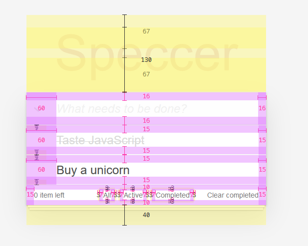

Use the following attribute to display element padding and margin:

```html
<div data-speccer class="..."></div>
```

This will display the element _and all of it's children_ padding and margin.

### Element dimensions

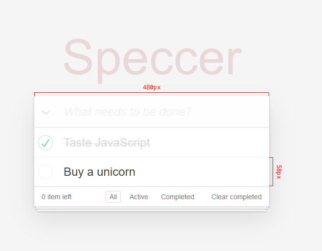

Display dimensions with:

```html
<div
  data-speccer-measure="[height right|left] | [width top|bottom]"
  class="..."
></div>
```

Where `height` and `width` comes with placement flags. Default for `height` is `left`, default for `width` is `top`.

#### Subtle measure

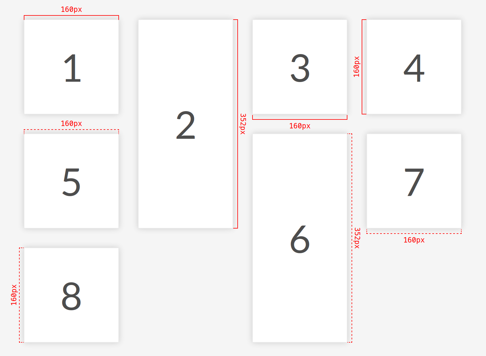

Use a subtle style:

```html
<div data-speccer-measure="height left subtle" class="..."></div>
```

This will give a dashed border.

### Highlight the anatomy of an element

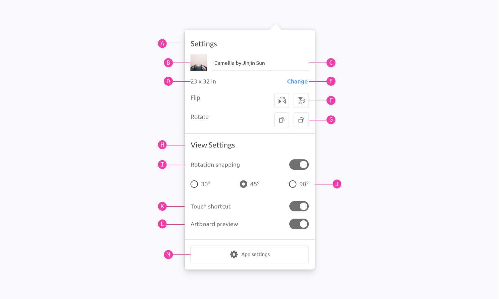

In your component examples, use the following attribute. Remember to use the `data-anatomy-section` as an attribute on a parent element to scope the marking.

```html
<div data-anatomy-section>
  <div
    data-anatomy="outline [full|enclose][curly] [left|right|top|bottom]"
    class="..."
  ></div>
</div>
```

This will place a pin to the outline of the element. Default is `top`.

#### Align with parent container

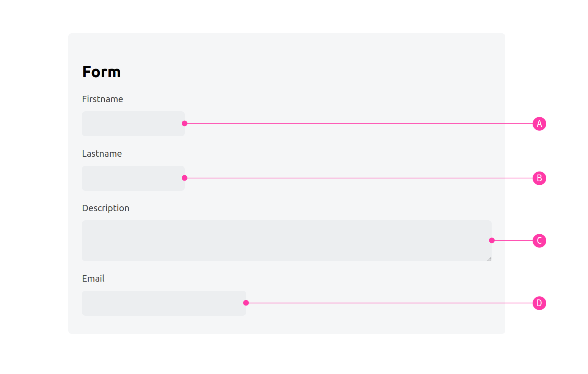

You can also align the pins to the parent container.

```html
<div data-anatomy-section>
  <div data-anatomy="outline parent [left|right|top|bottom]" class="..."></div>
</div>
```

> [!NOTE]  
> Only works with `outline [left|right|top|bottom]`, and not with `enclose`, `full` or `curly`!

The lines from the element to the pin is drawn with a svg path and circle, so remember to add the following svg into your document:

```html
<svg
  class="ph-speccer"
  viewBox="0 0"
  id="ph-speccer-svg"
  xmlns="http://www.w3.org/2000/svg"
>
  <path
    class="ph-speccer path original"
    id="ph-speccer-path"
    fill="none"
    stroke-width="1"
    stroke="currentColor"
  />
</svg>
```

#### Custom literals

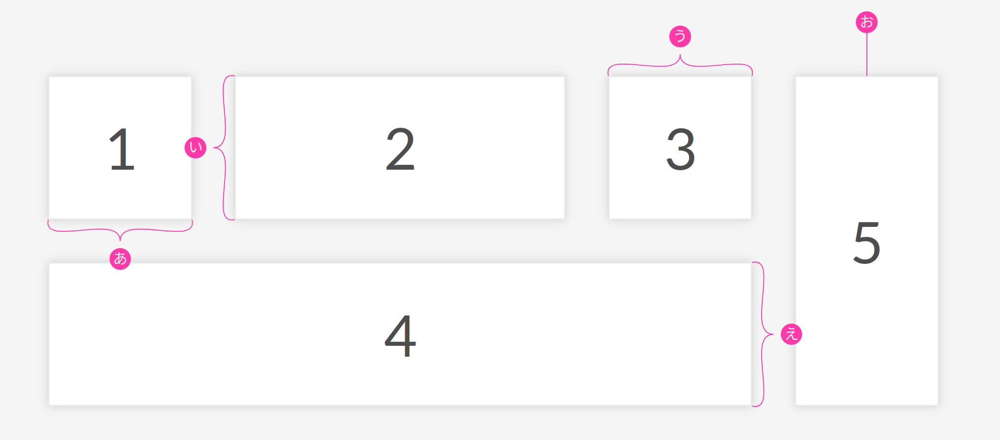

You can use custom literals by assigned a global variable with the literals you want:

```js
window.SPECCER_LITERALS = [
  'あ',
  'い',
  'う',
  'え',
  'お',
  'か',
  'き',
  'く',
  …
];
```

#### Subtle anatomy

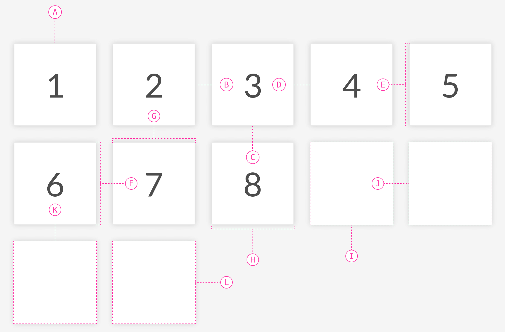

You can also give a more subtle touch to the anatomy elements.

```html
<div data-anatomy-section>
  <div data-anatomy="outline top subtle" class="..."></div>
</div>
```

This will give a dashed border, and a more subtle pin style.

#### Curly brackets

You can use curly brackets with the `curly` tag in `data-anatomy` along side `outline full` to provide a more sleek style.

> [!NOTE]  
> Only works with `outline full`

The curly brackets are made with SVG paths, and it is required to have the following snippet on your page for it to render:

```html
<svg
  class="ph-speccer"
  viewBox="0 0"
  id="ph-speccer-svg"
  xmlns="http://www.w3.org/2000/svg"
>
  <path
    class="ph-speccer path original"
    id="ph-speccer-path"
    fill="none"
    stroke-width="1"
    stroke="currentColor"
  />
</svg>
```

#### Highlight anatomy programatically

from v9.5 you can utilize the `dissect` feature to highlight the anatomy of an element programaticaly. [Here is an example with a click event](https://codepen.io/phun-ky/full/LYKOWyP).

[Kazam_screencast_00002.webm](https://github.com/user-attachments/assets/5c78cece-de46-4876-81f2-98c9108a2103)

### Element typography

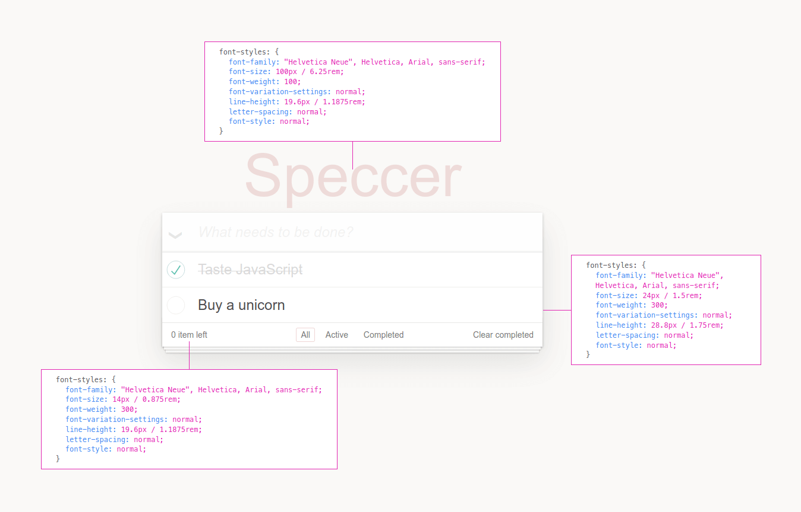

Display typography details:

```html
<p data-speccer-typography="[left|right|top|bottom]" class="...">Some text</p>
```

This will place a box to display typography information. Default is `left`.

> [!NOTE]  
> `getComputedStyles` are used to get the _computed_ values, so for example, a `line-height` set to `1.5` will be presented in pixels, like `96px` if the `font-size` is set to `64px`.

#### Syntax highlighting for typography

If you want to produce a box that uses `pre` and `code` tags with support for syntax highlighting ([PrismJS](https://prismjs.com/) compatible), add `syntax` to the `data-speccer-typography` attribute.

```html
<p data-speccer-typography="[left|right|top|bottom][syntax]" class="...">
  Some text
</p>
```

You can then override the colors, based on these variables:

```css
.ph-speccer.speccer.typography.syntax {
  --ph-speccer-color-code-color-1: #737373;
  --ph-speccer-color-code-color-2: #ff3aa8;
  --ph-speccer-color-code-color-3: #38383d;
  --ph-speccer-color-code-color-4: #ff3aa8;
  --ph-speccer-color-code-color-5: #ff3aa8;
  --ph-speccer-color-code-color-6: #0074e8;
  --ph-speccer-color-code-color-7: #000000;
  --ph-speccer-color-code-color-8: #cd0404;
}
```

Here is an example with these colors and overrides:

```css
.ph-speccer.speccer.typography.syntax {
  color: #8c9b9b;
  background-color: #262831;
  border-radius: 0.375rem;
  font-size: 12px;
  line-height: 1.5;
  border: none;
  --ph-speccer-color-code-color-1: #859ba3;
  --ph-speccer-color-code-color-2: #c79500;
  --ph-speccer-color-code-color-3: #2caaa0;
  --ph-speccer-color-code-color-4: #469edd;
  --ph-speccer-color-code-color-5: #8c9b9b;
  --ph-speccer-color-code-color-6: #e4e4e7;
  --ph-speccer-color-code-color-7: #262831;
  --ph-speccer-color-code-color-8: #ff6666;
}
```

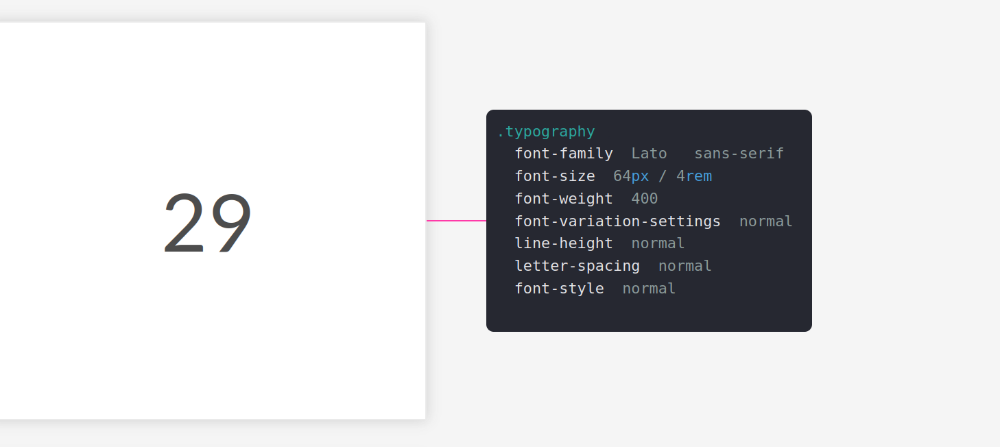

### Grid spacing

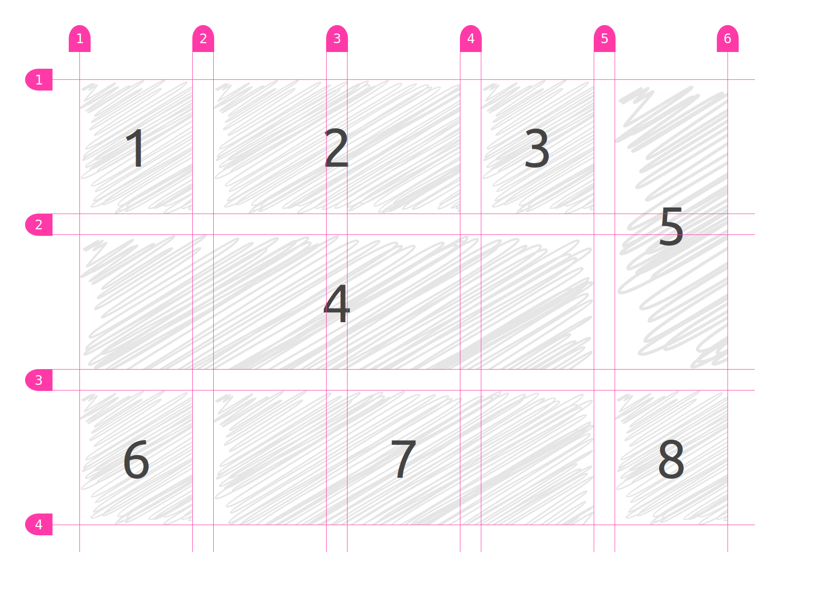

This will highlight the grid spacing in a `display: grid;` element.

In your component examples, use the following attribute on your grid container.

```html
<div data-speccer-grid="grid" …>…</div>
```

### Mark elements

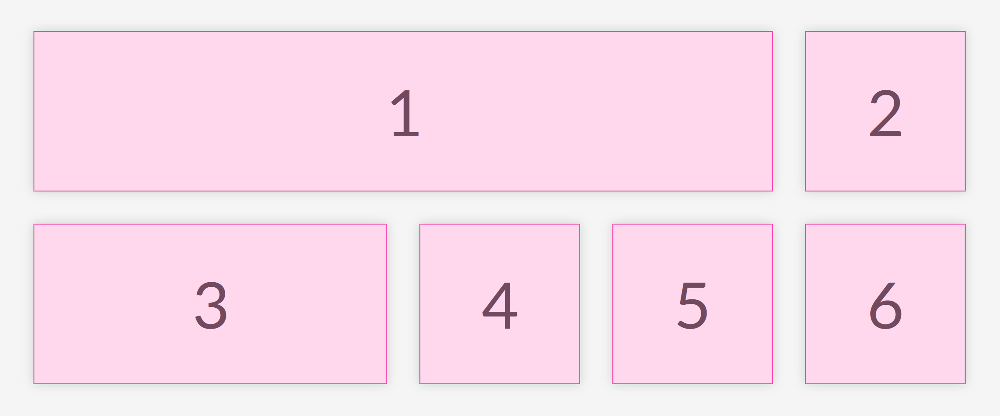

This will mark the given elements.

In your component examples, use the following attribute.

```html
<div data-speccer-mark …>…</div>
```

### A11y notation

With speccer, you can also display accessibility notation, like [Accessibility Bluelines](https://dribbble.com/shots/6269661-Accessibility-Bluelines?utm_source=Clipboard_Shot&utm_campaign=jeremyelder&utm_content=Accessibility%20Bluelines&utm_medium=Social_Share&utm_source=Clipboard_Shot&utm_campaign=jeremyelder&utm_content=Accessibility%20Bluelines&utm_medium=Social_Share):

Prior art: [Jeremy Elder](https://twitter.com/JeremyElder)

#### Tab stops

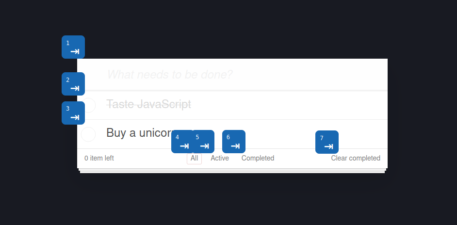

If you want to display tab stops, append `data-speccer-a11y-tabstops` as an attribute to the container you want to display the tab stops in.

#### Landmarks and regions

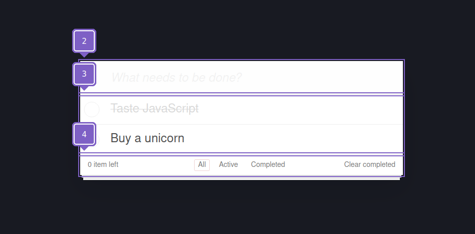

If you want to display landmarks and regions, append `data-speccer-a11y-landmark` as an attribute to the container you want to display the landmarks and regions in.

#### Keys and shortcut

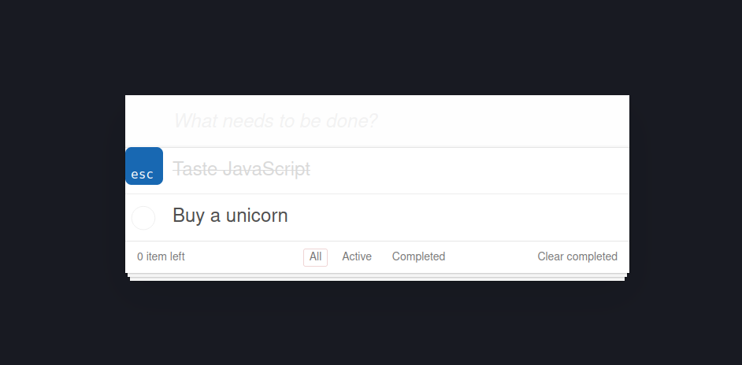

If you want to display the shortcut with keys used for elements, use `data-speccer-a11y-shortcut="<shortcut>"` on the element that uses this shortcut:

```html
<button type="button" data-speccer-a11y-shortcut="ctrl + s">Save</button>
```

## Customization

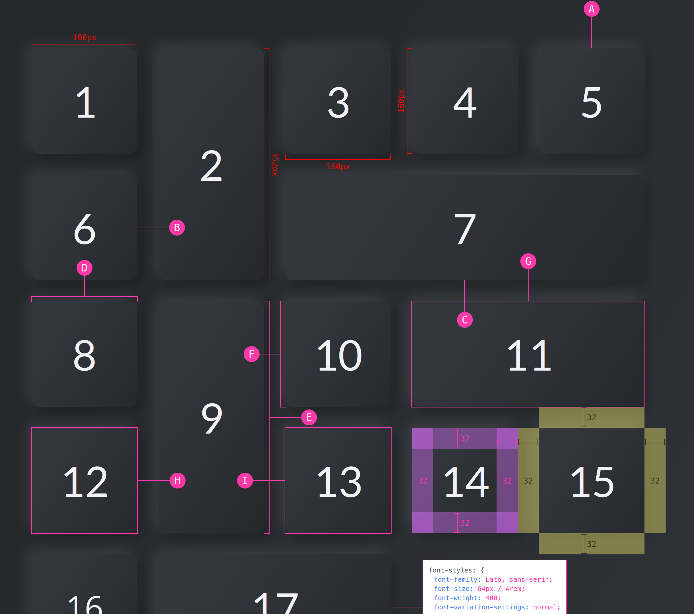

Allthough the styling works nicely with dark mode, you can use the provided CSS variables to customize the look and feel. If more control is needed, you can use CSS overrides :)

```css
.ph-speccer.speccer {
  --ph-speccer-spacing-color-padding: rgba(219, 111, 255, 0.4);
  --ph-speccer-spacing-color-padding-hover: #db6fff;
  --ph-speccer-spacing-color-margin: rgba(255, 247, 111, 0.4);
  --ph-speccer-spacing-color-margin-hover: #fff76f;
  --ph-speccer-color-text-light: #fff;
  --ph-speccer-color-text-dark: #333;
  --ph-speccer-base-color: #ff3aa8;
  --ph-speccer-spacing-color: var(--ph-speccer-base-color);
  --ph-speccer-measure-color: #f00;
  --ph-speccer-pin-color: var(--ph-speccer-base-color);
  --ph-speccer-typography-background-color: #fff;
  --ph-speccer-typography-color-property: #3f85f2;
  --ph-speccer-typography-color-text: #57575b;
  --ph-speccer-typography-color-value: var(--ph-speccer-base-color);
  --ph-speccer-opacity-40: 0.4;
  --ph-speccer-font-family: 'Menlo for Powerline', 'Menlo Regular for Powerline',
    'DejaVu Sans Mono', Consolas, Monaco, 'Andale Mono', 'Ubuntu Mono',
    monospace;
  --ph-speccer-font-size: 12px;
  --ph-speccer-line-height: 12px;
  --ph-speccer-pin-size: 24px;
  --ph-speccer-pin-space: 48px;
  --ph-speccer-line-width: 1px;
  --ph-speccer-line-width-negative: -1px;
  --ph-speccer-measure-size: 8px;
}
```

## Contributing

Want to contribute? Please read the [CONTRIBUTING.md](https://github.com/phun-ky/speccer/blob/main/CONTRIBUTING.md) and [CODE_OF_CONDUCT.md](https://github.com/phun-ky/speccer/blob/main/CODE_OF_CONDUCT.md)

## Sponsor me

I'm an Open Source evangelist, creating stuff that does not exist yet to help get rid of secondary activities and to enhance systems already in place, be it documentation or web sites.

The sponsorship is an unique opportunity to alleviate more hours for me to maintain my projects, create new ones and contribute to the large community we're all part of :)

[Support me on GitHub Sponsors](https://github.com/sponsors/phun-ky).


