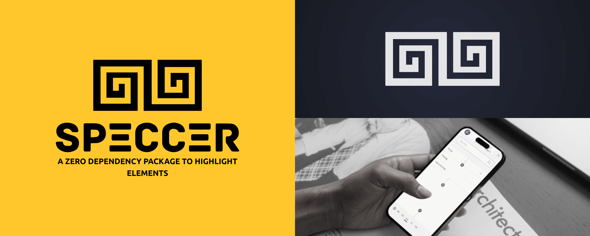
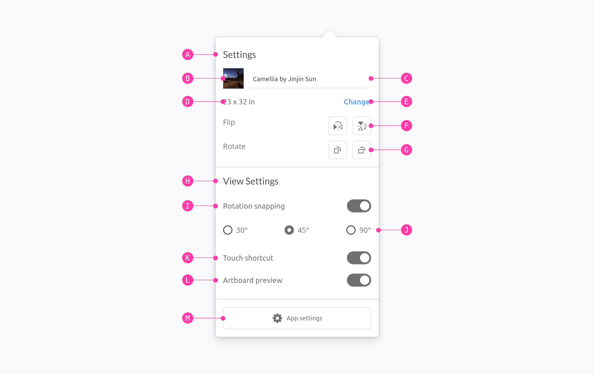
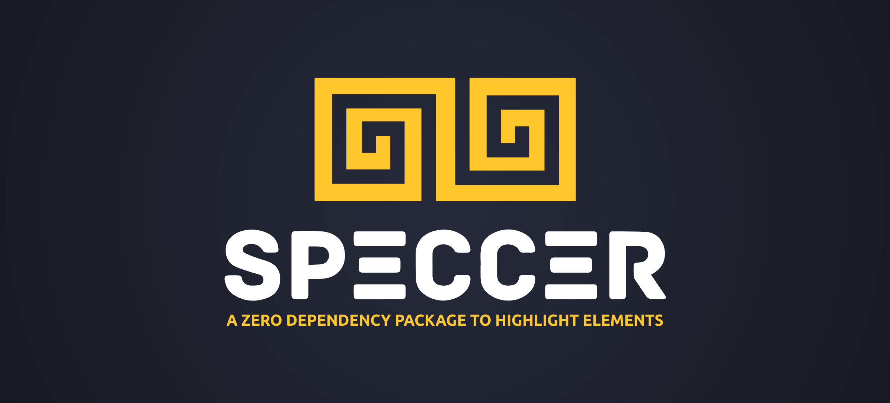

# SPECCER



[](http://commitizen.github.io/cz-cli/)
[](http://makeapullrequest.com)
[](http://semver.org/spec/v2.0.0.html)


[](https://codecov.io/gh/phun-ky/speccer)
[](https://github.com/phun-ky/speccer/actions/workflows/check.yml)

## About



**SPECCER** was originally created to simplify documenting components in a
design system, but it can be used to annotate or highlight any HTML element on a
webpage. If you need to draw attention to elements, **SPECCER** is your tool!

## Table of Contents<!-- omit from toc -->

- [SPECCER](#speccer)
  - [About](#about)
  - [Installation](#installation)
  - [Documentation](#documentation)
  - [Used by](#used-by)
  - [License](#license)
  - [Changelog](#changelog)
  - [Sponsor me](#sponsor-me)

## Installation

```shell-session
npm i --save @phun-ky/speccer
```

## Documentation

To see the documentation, go to [speccer.dev](https://speccer.dev).

## Used by

| [](https://www.if-insurance.com) | [](https://24sevenoffice.com) |
| ---------------------------------------------------------------------------------- | ----------------------------------------------------------------------------------- |

## License

This project is licensed under the MIT License - see the
[LICENSE](https://github.com/phun-ky/speccer/blob/main/LICENSE) file for
details.

## Changelog

See the
[CHANGELOG.md](https://github.com/phun-ky/speccer/blob/main/CHANGELOG.md) for
details on the latest updates.

## Sponsor me

I'm an Open Source evangelist, creating stuff that does not exist yet to help
get rid of secondary activities and to enhance systems already in place, be it
documentation or web sites.

The sponsorship is an unique opportunity to alleviate more hours for me to
maintain my projects, create new ones and contribute to the large community
we're all part of :)

[Support me on GitHub Sponsors](https://github.com/sponsors/phun-ky).



p.s. **Ukraine is still under brutal Russian invasion. A lot of Ukrainian people
are hurt, without shelter and need help**. You can help in various ways, for
instance, directly helping refugees, spreading awareness, putting pressure on
your local government or companies. You can also support Ukraine by donating
e.g. to [Red Cross](https://www.icrc.org/en/donate/ukraine),
[Ukraine humanitarian organisation](https://savelife.in.ua/en/donate-en/#donate-army-card-weekly)
or
[donate Ambulances for Ukraine](https://www.gofundme.com/f/help-to-save-the-lives-of-civilians-in-a-war-zone).
