# @phun-ky/speccer


[](http://commitizen.github.io/cz-cli/) [](http://makeapullrequest.com) [](http://semver.org/spec/v2.0.0.html)       [](https://codecov.io/gh/phun-ky/speccer) [](https://github.com/phun-ky/speccer/actions/workflows/check.yml)

## About


**SPECCER** was originally created to simplify documenting components in a design system, but it can be used to highlight any HTML element on a webpage. If you need to draw attention to elements, **SPECCER** is your tool!

## Table of Contents<!-- omit from toc -->

- [@phun-ky/speccer](#phun-kyspeccer)
  - [About](#about)
  - [Installation](#installation)
  - [Usage](#usage)
    - [Typescript](#typescript)
    - [ESM](#esm)
      - [Lazy loading](#lazy-loading)
    - [Script](#script)
      - [Advanced usage](#advanced-usage)
    - [React](#react)
  - [Features](#features)
    - [Element spacing](#element-spacing)
      - [Bound spacing](#bound-spacing)
    - [Element dimensions](#element-dimensions)
      - [Slim measure](#slim-measure)
    - [Pin element to highlight the anatomy](#pin-element-to-highlight-the-anatomy)
      - [Default](#default)
      - [Enclose](#enclose)
      - [Align with parent container](#align-with-parent-container)
      - [Pin with text](#pin-with-text)
      - [Custom literals](#custom-literals)
      - [Subtle anatomy](#subtle-anatomy)
      - [Curly brackets](#curly-brackets)
      - [Pin programatically](#pin-programatically)
    - [Element typography](#element-typography)
      - [Syntax highlighting for typography](#syntax-highlighting-for-typography)
    - [Grid spacing](#grid-spacing)
    - [Mark elements](#mark-elements)
    - [A11y notation](#a11y-notation)
      - [Tab stops](#tab-stops)
      - [Landmarks and regions](#landmarks-and-regions)
      - [Keys and shortcut](#keys-and-shortcut)
    - [Customization](#customization)
  - [API](#api)
  - [Development](#development)
  - [Contributing](#contributing)
  - [License](#license)
  - [Changelog](#changelog)
  - [FAQ](#faq)
  - [Sponsor me](#sponsor-me)

## Installation

```shell-session
npm i --save @phun-ky/speccer
```

[See a live demo](https://codepen.io/phun-ky/pen/OJejexN).

## Usage

### Typescript

Types can be found in `@phun-ky/speccer/dist/speccer.d.ts`.

### ESM

Either import and run the required functions:

```javascript
import '@phun-ky/speccer/dist/speccer.min.css';
import speccer from '@phun-ky/speccer';

// do stuff
speccer();
```

#### Lazy loading

If you're importing **SPECCER** instead of with a script tag, [you can use the following approach](https://codepen.io/phun-ky/pen/VwRRLyY) to apply lazy loading:

```javascript
import { pin } from "https://esm.sh/@phun-ky/speccer";

const { pinElements } = pin;

/**
 * Callback function for IntersectionObserver
 * @param {IntersectionObserverEntry[]} entries - Array of entries being observed
 * @param {IntersectionObserver} observer - The IntersectionObserver instance
 * @returns {Promise<void>} Promise that resolves when element dissection is complete
 */
const intersectionCallback: IntersectionObserverCallback = async (entries, observer) => {
  entries.forEach(async (entry) => {
    if (entry.intersectionRatio > 0) {
      await pinElements(entry.target);
      observer.unobserve(entry.target);
    }
  });
};

// Creating IntersectionObserver instance with the callback
const pinElementObserver = new IntersectionObserver(intersectionCallback);

/**
 * Function to observe elements using IntersectionObserver
 * @param {Element} el - The element to be observed
 */
const observeElement = (el: Element): void => {
  pinElementObserver.observe(el);
};

// Observing elements with the specified data attribute
document.querySelectorAll('[data-speccer="pin-area"]').forEach((el) => {
  observeElement(el);
});
```

### Script

Or place these `script` and `link` tags in your web page:

```html
<link rel="stylesheet" href="../path/to/speccer.min.css" />
<script src="../path/to/speccer.js"></script>
```

Or with a CDN:

```html
<link
  rel="stylesheet"
  href="https://unpkg.com/@phun-ky/speccer/dist/speccer.min.css"
/>
<script src="https://unpkg.com/@phun-ky/speccer/dist/speccer.js"></script>
```

And then follow the steps below to display the specifications you want :)

#### Advanced usage

If you want to control **SPECCER** a bit more, you have some options. Apply one of these attributes to the script element for different types of initialization:

```html
<script src="../speccer.js" data-<manual|instant|dom|lazy></script>
```

Or with a CDN:

```html
<script src="https://unpkg.com/@phun-ky/speccer/dist/speccer.js" data-<manual|instant|dom|lazy></script>
```

| Tag            | Description                                                         |
| -------------- | ------------------------------------------------------------------- |
| `data-manual`  | Makes `window.speccer()` available to be used when you feel like it |
| `data-instant` | fires off `speccer()` right away                                    |
| `data-dom`     | Waits for `DOMContentLoaded`                                        |
| `data-lazy`    | Lazy loads `speccer()` per specced element                          |

If no attribute is applied, it will default to `data-dom`, as in, it will initialize when `DOMContentLoaded` is fired.

### React

If you use React, you can use an effect like this:

```javascript
import React, { useEffect } from 'react';
import PropTypes from 'prop-types';

import debounce from './lib/debounce';
import '@phun-ky/speccer/dist/speccer.min.css';

const Component = () => {
  let speccerEventFunc;

  useEffect(async () => {
    const { default: speccer } = await import('@phun-ky/speccer');

    speccer();

    speccerEventFunc = debounce(function () {
      speccer();
    }, 300);

    window.addEventListener('resize', speccerEventFunc);
    return () => {
      window.removeEventListener('resize', speccerEventFunc);
    };
  }, []);

  return <div />;
};

export default Component;
```

## Features

### Element spacing

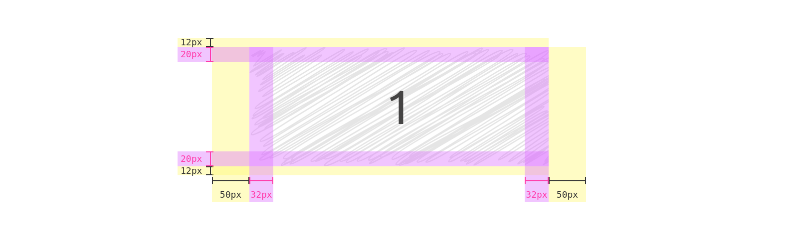

Use the following attribute to display element padding and margin:

```html
<div data-speccer="spacing [padding|margin] [bound]" class="…"></div>
```

This will display the element _and all of it's children_ padding and margin, unless you specify `padding` and `margin`

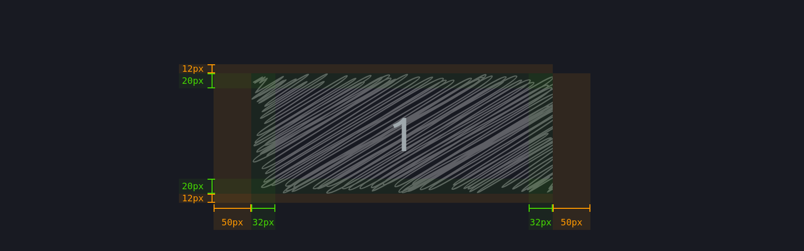

#### Bound spacing


This option binds the speccer elements to the bounds of the element container.

```html
<div data-speccer="spacing bound" class="…"></div>
```

### Element dimensions

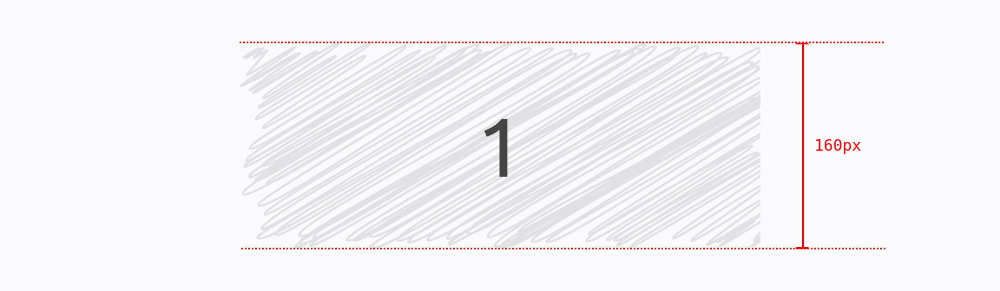
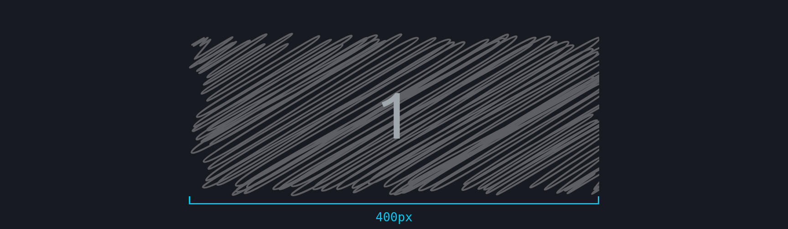

Display dimensions with:

```html
<div
  data-speccer="measure [height left|right] | [width top|bottom]"
  class="..."
></div>
```

Where `height` and `width` comes with placement flags. Default for `height` is `left`, default for `width` is `top`.

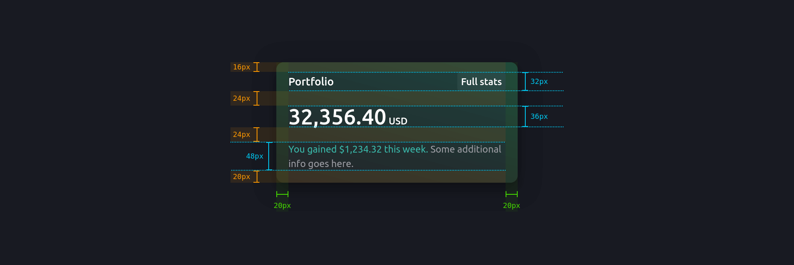

#### Slim measure

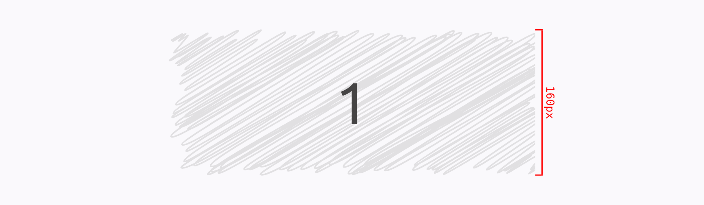

Use a slim style:

```html
<div data-speccer="measure slim height left" class="..."></div>
```

This will give a slimmer look and feel.

##### Subtle slim measure

Use a subtle style for the slim option, uses a dashed line instead of a solid line:

```html
<div data-speccer="measure slim height left subtle" class="..."></div>
```

This will give a dashed border.

### Pin element to highlight the anatomy


In your component examples, use the following attribute. Remember to use the `data-speccer="pin-area"`-attribute on a parent element to scope the marking.

```html
<div data-speccer="pin-area">
  <div
    data-speccer="pin [bracket [curly] |enclose] [left|right|top|bottom]"
    class="..."
  ></div>
</div>
```

This will place a pin to the outline of the element. Default is `top`.

#### Default


```html
<div data-speccer="pin-area">
  <div data-speccer="pin" class="..."></div>
</div>
```

#### Enclose


```html
<div data-speccer="pin-area">
  <div data-speccer="pin enclose" class="..."></div>
</div>
```

##### Subtle enclose

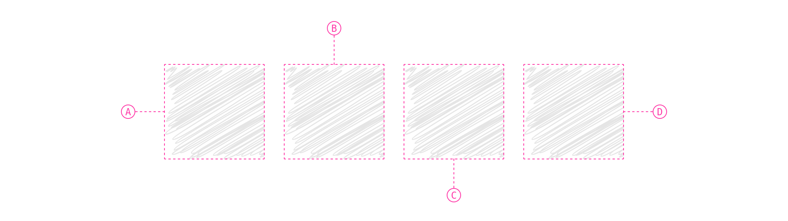

```html
<div data-speccer="pin-area">
  <div data-speccer="pin enclose" class="..."></div>
</div>
```

#### Align with parent container

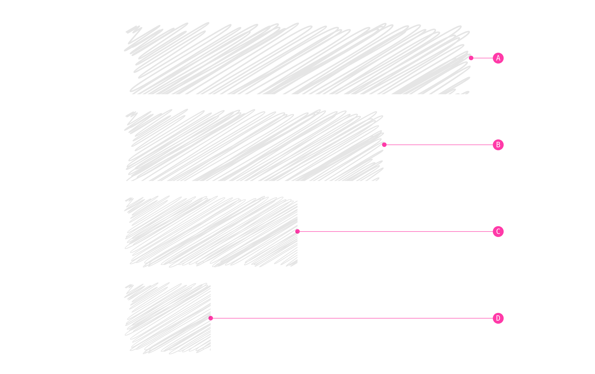

You can also align the pins to the parent container.

```html
<div data-speccer="pin-area">
  <div data-speccer="pin parent [left|right|top|bottom]" class="..."></div>
</div>
```

> [!NOTE]  
> Only works with `pin [left|right|top|bottom]`, and not with `enclose`, `bracket` or `curly`!

The lines from the element to the pin is drawn with a svg path and circle, so remember to add the following svg into your document:

```html
<svg
  class="ph-speccer"
  viewBox="0 0"
  id="ph-speccer-svg"
  xmlns="http://www.w3.org/2000/svg"
>
  <path
    class="ph-speccer path original"
    id="ph-speccer-path"
    fill="none"
    stroke-width="1"
    stroke="currentColor"
  />
</svg>
```


#### Pin with text

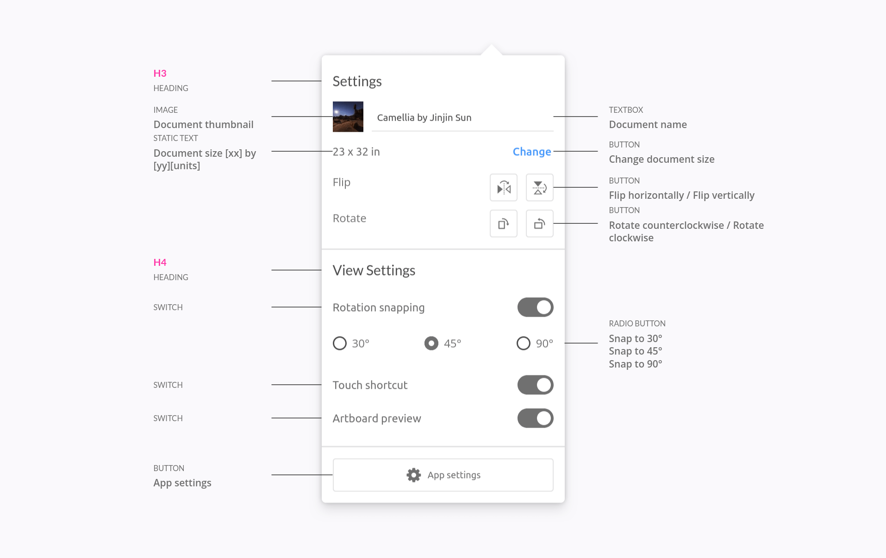

If you want _text-in-place_ pinning feature, instead of referencing the pins, you can use the `text` feature:

```html
<input
  type="text"
  …
  data-speccer="pin left text"
  data-speccer-title="Static text"
  data-speccer-description="Document size [xx] by [yy][units]"
  …
/>
```

#### Custom literals


You can use custom literals by assigned a global variable with the literals you want:

```js
window.SPECCER_LITERALS = [
  'あ',
  'い',
  'う',
  'え',
  'お',
  'か',
  'き',
  'く',
  …
];
```

Or with a data attribute on the `data-speccer="pin-area"`-element:

```html
<div data-speccer="pin-area" data-speccer-literals="ऄ|अआइईउऊऋऌऍऎएऐऑऒओऔकखगघङच">
  …
</div>
```

> [!TIP]
> Try it out with emoticons!
>
> ```js
> window.SPECCER_LITERALS = [
>   '🥰',
>   …
> ];
> ```

#### Subtle anatomy

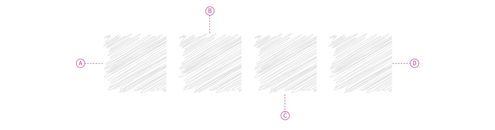

You can also give a more subtle touch to the anatomy elements.

```html
<div data-speccer="pin-area">
  <div data-speccer="pin top subtle" class="..."></div>
</div>
```

This will give a dashed border, and a more subtle pin style.

#### Curly brackets

You can use curly brackets with the `curly` tag in `data-speccer` along side `pin bracket` to provide a more sleek style.

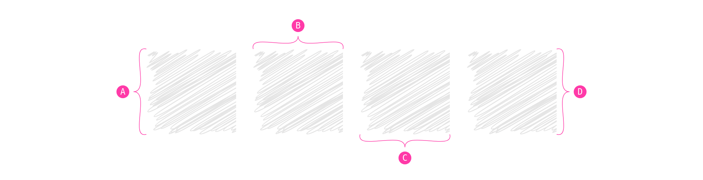

> [!NOTE]  
> Only works with `pin bracket`

The curly brackets are made with SVG paths, and it is required to have the following snippet on your page for it to render:

```html
<svg
  class="ph-speccer"
  viewBox="0 0"
  id="ph-speccer-svg"
  xmlns="http://www.w3.org/2000/svg"
>
  <path
    class="ph-speccer path original"
    id="ph-speccer-path"
    fill="none"
    stroke-width="1"
    stroke="currentColor"
  />
</svg>
```

#### Pin programatically

from v9.5 you can utilize the `pin` feature to highlight the anatomy of an element programaticaly. [Here is an example with a click event](https://codepen.io/phun-ky/pen/LYKOWyP).

[Kazam_screencast_00002.webm](https://github.com/user-attachments/assets/5c78cece-de46-4876-81f2-98c9108a2103)

### Element typography


Display typography details:

```html
<p data-speccer="typography [left|right|top|bottom]" class="...">Some text</p>
```

This will place a box to display typography information. Default is `left`.

> [!NOTE]  
> `getComputedStyles` are used to get the _computed_ values, so for example, a `line-height` set to `1.5` will be presented in pixels, like `96px` if the `font-size` is set to `64px`.

#### Syntax highlighting for typography

If you want to produce a box that uses `pre` and `code` tags with support for syntax highlighting ([PrismJS](https://prismjs.com/) compatible), add `syntax` to the `data-speccer="typography"` attribute.

```html
<p data-speccer="typography syntax right" class="...">Some text</p>
```

You can then override the colors, based on these variables:

```css
.ph-speccer.speccer.typography.syntax {
  --ph-speccer-color-code-color-1: #737373;
  --ph-speccer-color-code-color-2: #ff3aa8;
  --ph-speccer-color-code-color-3: #38383d;
  --ph-speccer-color-code-color-4: #ff3aa8;
  --ph-speccer-color-code-color-5: #ff3aa8;
  --ph-speccer-color-code-color-6: #0074e8;
  --ph-speccer-color-code-color-7: #000000;
  --ph-speccer-color-code-color-8: #cd0404;
}
```

Here is an example with these colors and overrides:

```css
.ph-speccer.speccer.typography.syntax {
  color: #8c9b9b;
  background-color: #262831;
  border-radius: 0.375rem;
  font-size: 12px;
  line-height: 1.5;
  border: none;
  --ph-speccer-color-code-color-1: #859ba3;
  --ph-speccer-color-code-color-2: #c79500;
  --ph-speccer-color-code-color-3: #2caaa0;
  --ph-speccer-color-code-color-4: #469edd;
  --ph-speccer-color-code-color-5: #8c9b9b;
  --ph-speccer-color-code-color-6: #e4e4e7;
  --ph-speccer-color-code-color-7: #262831;
  --ph-speccer-color-code-color-8: #ff6666;
}
```

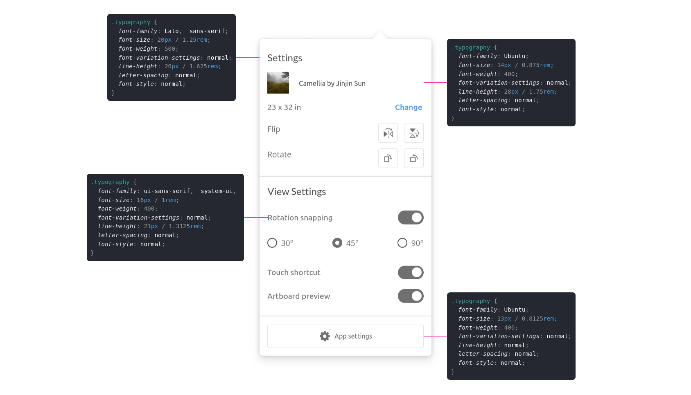

### Grid spacing

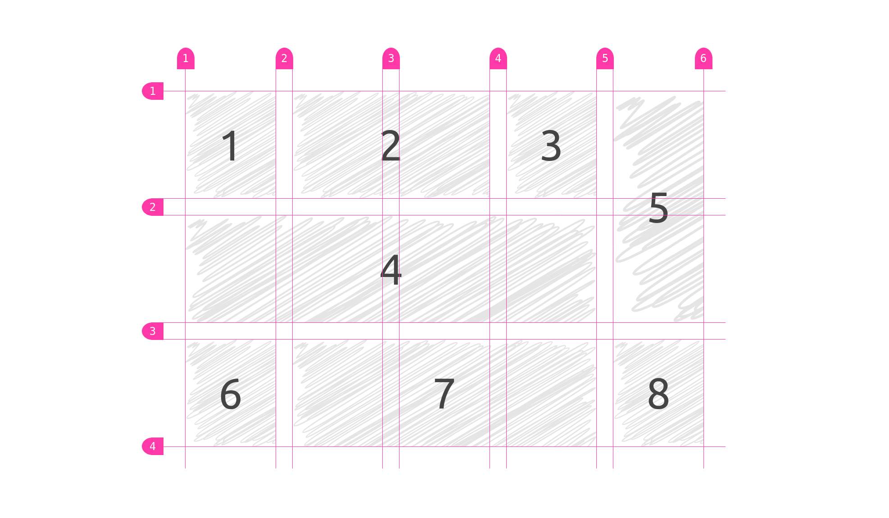

This will highlight the grid spacing in a `display: grid;` element.

In your component examples, use the following attribute on your grid container.

```html
<div data-speccer="grid" …>…</div>
```

> [!TIP]
> If you only want to display `rows` or `columns`, use this syntax (default is both with `grid` only):
>
> ```html
> <div data-speccer="grid [rows|columns]" …>…</div>
> ```

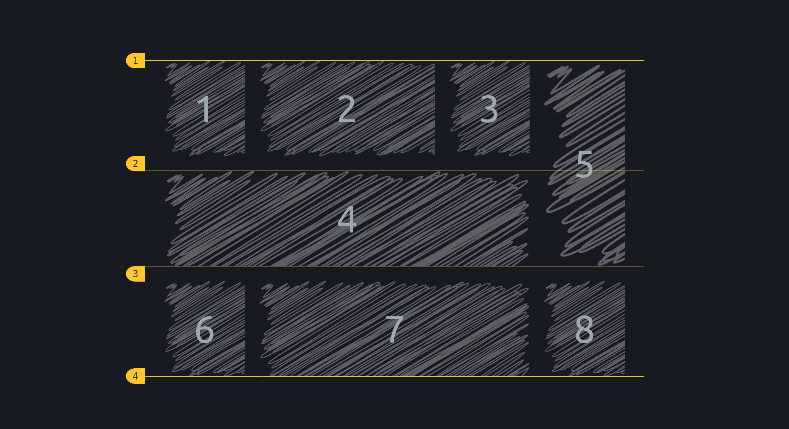

### Mark elements

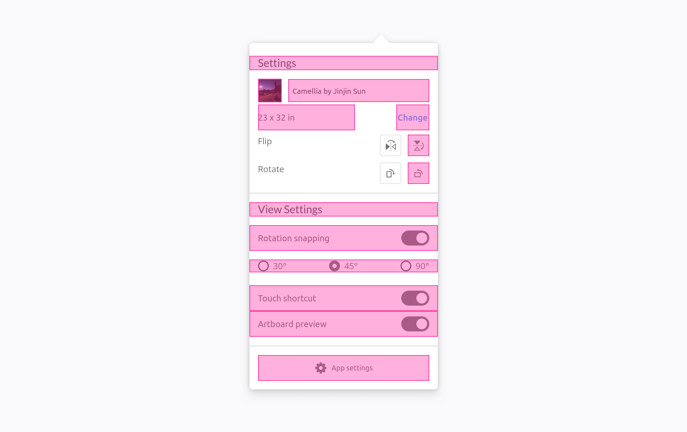

This will mark the given elements.

In your component examples, use the following attribute.

```html
<div data-speccer="mark" …>…</div>
```

### A11y notation

With **SPECCER**, you can also display accessibility notation, like [Accessibility Bluelines](https://dribbble.com/shots/6269661-Accessibility-Bluelines?utm_source=Clipboard_Shot&utm_campaign=jeremyelder&utm_content=Accessibility%20Bluelines&utm_medium=Social_Share&utm_source=Clipboard_Shot&utm_campaign=jeremyelder&utm_content=Accessibility%20Bluelines&utm_medium=Social_Share):

Prior art: [Jeremy Elder](https://twitter.com/JeremyElder)

#### Tab stops

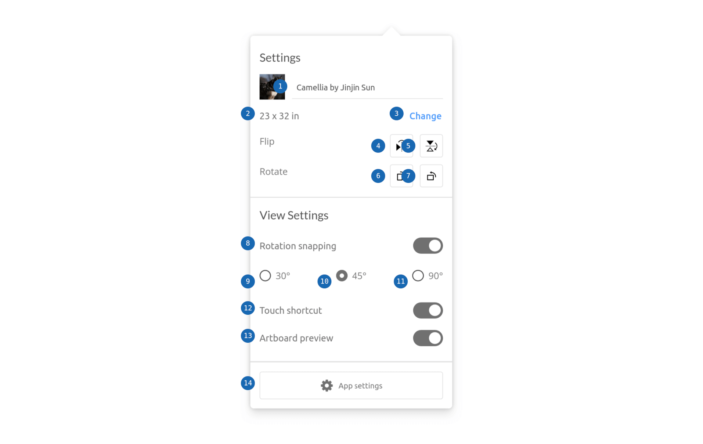

If you want to display tab stops, append `data-speccer="a11y tabstops"` as an attribute to the container you want to display the tab stops in.

#### Landmarks and regions

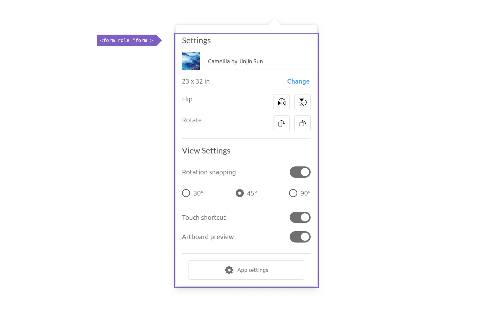

If you want to display landmarks and regions, append `data-speccer="a11y landmark"` as an attribute to the container you want to display the landmarks and regions in.

#### Keys and shortcut

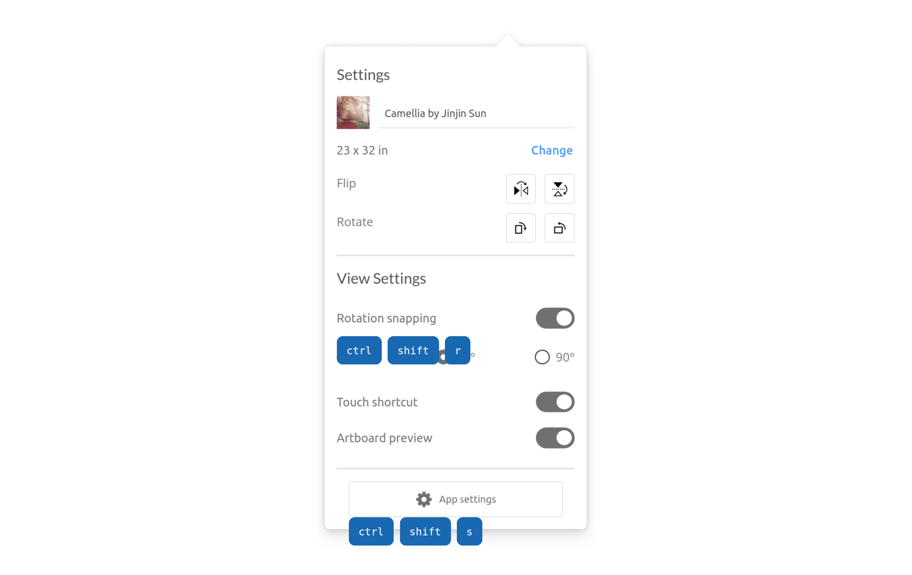

If you want to display the shortcut with keys used for elements, use `data-speccer="a11y shortcut"` and `data-speccer-a11y-shortcut="<shortcut>"` on the element that uses this shortcut:

```html
<button
  type="button"
  data-speccer="a11y shortcut"
  data-speccer-a11y-shortcut="ctrl + s"
>
  Save
</button>
```

### Customization


Allthough the styling works nicely with dark mode, you can use the provided CSS variables to customize the look and feel. If more control is needed, you can use CSS overrides :)

```css
.ph-speccer.speccer {
  --ph-speccer-color-artificialStrawberry: #ff3aa8;
  --ph-speccer-color-venusSlipperOrchid: #db6fff;
  --ph-speccer-color-superBanana: #fff76f;
  --ph-speccer-color-white: #ffffff;
  --ph-speccer-color-carbon: #333333;
  --ph-speccer-color-red: #ff0000;
  --ph-speccer-color-niuZaiSeDenim: #0074e8;
  --ph-speccer-color-beautifulBlue: #1868b2;
  --ph-speccer-color-fuchsiaBlue: #7e60c5;
  --ph-speccer-base-color: var(--ph-speccer-color-artificialStrawberry);
  --ph-speccer-spacing-color: var(--ph-speccer-base-color);
  --ph-speccer-spacing-padding-color: var(--ph-speccer-color-carbon);
  --ph-speccer-spacing-padding-color-background: rgb(
    from var(--ph-speccer-color-venusSlipperOrchid) r g b /
      var(--ph-speccer-opacity-40)
  );
  --ph-speccer-spacing-margin-color: var(--ph-speccer-color-red);
  --ph-speccer-spacing-margin-color-background: rgb(
    from var(--ph-speccer-color-superBanana) r g b /
      var(--ph-speccer-opacity-40)
  );
  --ph-speccer-spacing-line-width: var(--ph-speccer-line-width);
  --ph-speccer-typography-background-color: var(--ph-speccer-color-white);
  --ph-speccer-typography-color-property: var(--ph-speccer-color-niuZaiSeDenim);
  --ph-speccer-typography-color-text: var(--ph-speccer-base-color);
  --ph-speccer-typography-color-value: var(--ph-speccer-base-color);
  --ph-speccer-mark-background-color: rgb(
    from var(--ph-speccer-base-color) r g b / var(--ph-speccer-opacity-20)
  );
  --ph-speccer-mark-border-color: var(--ph-speccer-base-color);
  --ph-speccer-mark-border-width: 1.5px;
  --ph-speccer-mark-border-style: solid;
  --ph-speccer-measure-color: var(--ph-speccer-color-red);
  --ph-speccer-measure-line-width: 1.5px;
  --ph-speccer-measure-border-style: dotted;
  --ph-speccer-measure-size: 8px;
  --ph-speccer-a11y-color-background: var(--ph-speccer-color-beautifulBlue);
  --ph-speccer-a11y-landmark-color-background: var(
    --ph-speccer-color-fuchsiaBlue
  );
  --ph-speccer-color-text-light: var(--ph-speccer-color-white);
  --ph-speccer-color-text-dark: var(--ph-speccer-color-carbon);
  --ph-speccer-pin-color: var(--ph-speccer-base-color);
  --ph-speccer-pin-size: 24px;
  --ph-speccer-pin-space: 48px;
  --ph-speccer-line-height: 12px;
  --ph-speccer-line-width: 1.5px;
  --ph-speccer-line-width-negative: -1.5px;
  --ph-speccer-opacity-20: 0.2;
  --ph-speccer-opacity-40: 0.4;
  --ph-speccer-font-family: 'Menlo for Powerline', 'Menlo Regular for Powerline',
    'DejaVu Sans Mono', Consolas, Monaco, 'Andale Mono', 'Ubuntu Mono',
    monospace;
  --ph-speccer-font-size: 12px;
  --ph-speccer-transition-default: all 2s cubic-bezier(0.4, 0, 0.2, 1);
}
```

## API

Full API documentation is available [here](https://github.com/phun-ky/speccer/blob/main/api/README.md).

## Development

```
// Build
$ npm run build
// Run dev
$ npm run dev
// Test
$ npm test
```

## Contributing

Want to contribute? Please read the [CONTRIBUTING.md](https://github.com/phun-ky/speccer/blob/main/CONTRIBUTING.md) and [CODE_OF_CONDUCT.md](https://github.com/phun-ky/speccer/blob/main/CODE_OF_CONDUCT.md)

## License

This project is licensed under the MIT License - see the [LICENSE](https://github.com/phun-ky/speccer/blob/main/LICENSE) file for details.

## Changelog

See the [CHANGELOG.md](https://github.com/phun-ky/speccer/blob/main/CHANGELOG.md) for details on the latest updates.

## FAQ

See the [discussions](https://github.com/phun-ky/speccer/discussions/categories/q-a) for an FAQ or to ask questions if no answer is given.

## Sponsor me

I'm an Open Source evangelist, creating stuff that does not exist yet to help get rid of secondary activities and to enhance systems already in place, be it documentation or web sites.

The sponsorship is an unique opportunity to alleviate more hours for me to maintain my projects, create new ones and contribute to the large community we're all part of :)

[Support me on GitHub Sponsors](https://github.com/sponsors/phun-ky).


p.s. **Ukraine is still under brutal Russian invasion. A lot of Ukrainian people are hurt, without shelter and need help**. You can help in various ways, for instance, directly helping refugees, spreading awareness, putting pressure on your local government or companies. You can also support Ukraine by donating e.g. to [Red Cross](https://www.icrc.org/en/donate/ukraine), [Ukraine humanitarian organisation](https://savelife.in.ua/en/donate-en/#donate-army-card-weekly) or [donate Ambulances for Ukraine](https://www.gofundme.com/f/help-to-save-the-lives-of-civilians-in-a-war-zone).
