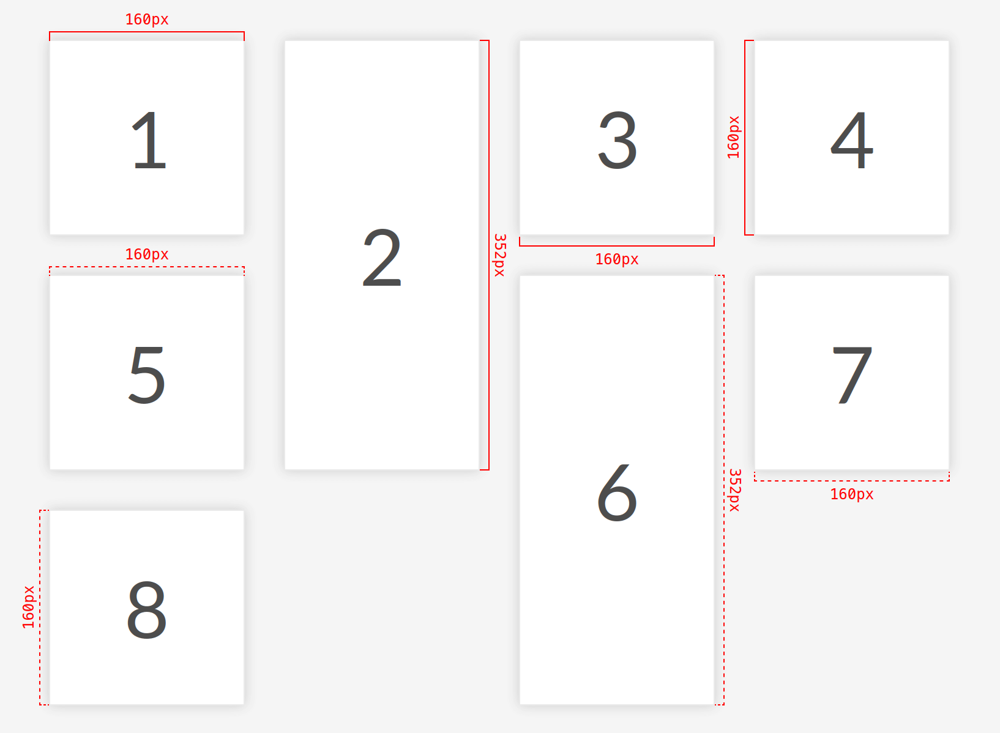
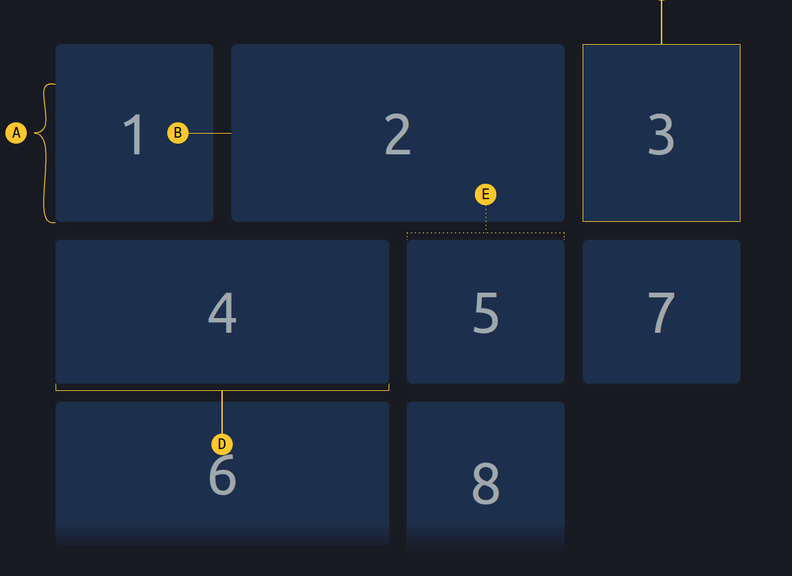

# @phun-ky/speccer


> A zero dependency package to highlight elements

[](http://commitizen.github.io/cz-cli/) [](http://makeapullrequest.com) [](http://semver.org/spec/v2.0.0.html)       [](https://codecov.io/gh/phun-ky/speccer)


- [@phun-ky/speccer](#phun-kyspeccer)
  - [About](#about)
  - [API](#api)
  - [Usage](#usage)
    - [Typescript](#typescript)
    - [ESM](#esm)
    - [Script](#script)
    - [React](#react)
  - [Advanced usage](#advanced-usage)
    - [Lazy](#lazy)
  - [Features](#features)
    - [Element spacing](#element-spacing)
    - [Element dimensions](#element-dimensions)
      - [Subtle measure](#subtle-measure)
    - [Highlight the anatomy of an element](#highlight-the-anatomy-of-an-element)
      - [Subtle anatomy](#subtle-anatomy)
    - [Curly brackets](#curly-brackets)
    - [Element typography](#element-typography)
    - [Grid spacing](#grid-spacing)
    - [Mark elements](#mark-elements)
    - [A11y notation](#a11y-notation)
      - [Tab stops](#tab-stops)
      - [Landmarks and regions](#landmarks-and-regions)
      - [Keys and shortcut](#keys-and-shortcut)
  - [Customization](#customization)
  - [Contributing](#contributing)
  - [Sponsor me](#sponsor-me)

## About

Speccer was originally created to make it easier to document components in a design system, but you can use it to whatever you like, if you are in the need to highlight any element!

```shell-session
npm i @phun-ky/speccer
```

See demo here: <https://codepen.io/phun-ky/pen/OJejexN>

## API

Go [here](https://github.com/phun-ky/speccer/blob/main/api/README.md) to read the full API documentation.

## Usage

### Typescript

Types can be found in `@phun-ky/speccer/dist/speccer.d.ts`.

### ESM

Either import and run the required functions:

```javascript
import '@phun-ky/speccer/dist/speccer.min.css';
import speccer from '@phun-ky/speccer';

// do stuff
speccer();
```

### Script

Or place these `script` and `link` tags in your web page:

```html
<link rel="stylesheet" href="../path/to/speccer.min.css" />
<script src="../path/to/speccer.js"></script>
```

Or with a CDN:

```html
<link
  rel="stylesheet"
  href="https://unpkg.com/@phun-ky/speccer/dist/speccer.min.css"
/>
<script src="https://unpkg.com/@phun-ky/speccer/dist/speccer.js"></script>
```

And then follow the steps below to display the specifications you want :)

### React

If you use React, you can use an effect like this:

```javascript
import React, { useEffect } from 'react';
import PropTypes from 'prop-types';

import debounce from './lib/debounce';
import '@phun-ky/speccer/dist/speccer.min.css';

const Component = () => {
  let speccerEventFunc;

  useEffect(async () => {
    const { default: speccer } = await import('@phun-ky/speccer');

    speccer();

    speccerEventFunc = debounce(function () {
      speccer();
    }, 300);

    window.addEventListener('resize', speccerEventFunc);
    return () => {
      window.removeEventListener('resize', speccerEventFunc);
    };
  }, []);

  return <div />;
};

export default Component;
```

## Advanced usage

If you want to control speccer a bit more, you have some options. Apply one of these attributes to the script element for different types of initialization:

```html
<script src="../speccer.js" data-<manual|instant|dom|lazy></script>
```

Or with a CDN:

```html
<script src="https://unpkg.com/@phun-ky/speccer/dist/speccer.js" data-<manual|instant|dom|lazy></script>
```

| Tag            | Description                                                         |
| -------------- | ------------------------------------------------------------------- |
| `data-manual`  | Makes `window.speccer()` available to be used when you feel like it |
| `data-instant` | fires off `speccer()` right away                                    |
| `data-dom`     | Waits for `DOMContentLoaded`                                        |
| `data-lazy`    | Lazy loads `speccer()` per specced element                          |

If no attribute is applied, it will default to `data-dom`, as in, it will initialize when `DOMContentLoaded` is fired.

### Lazy

If you're importing speccer instead of with a script tag, [you can use the following approach](https://codepen.io/phun-ky/pen/VwRRLyY) to apply lazy loading:

```javascript
import { dissect, ElementDissectionResult } from "https://esm.sh/@phun-ky/speccer";

/**
 * Function to dissect an HTML element
 * @param {Element} target - The element to be dissected
 * @returns {Promise<ElementDissectionResult>} Promise that resolves with the dissection result
 */
const dissectElement = (target: Element): Promise<ElementDissectionResult> => {
  return dissect.element(target);
};

/**
 * Callback function for IntersectionObserver
 * @param {IntersectionObserverEntry[]} entries - Array of entries being observed
 * @param {IntersectionObserver} observer - The IntersectionObserver instance
 * @returns {Promise<void>} Promise that resolves when element dissection is complete
 */
const intersectionCallback: IntersectionObserverCallback = async (entries, observer) => {
  entries.forEach(async (entry) => {
    if (entry.intersectionRatio > 0) {
      await dissectElement(entry.target);
      observer.unobserve(entry.target);
    }
  });
};

// Creating IntersectionObserver instance with the callback
const dissectElementObserver = new IntersectionObserver(intersectionCallback);

/**
 * Function to observe elements using IntersectionObserver
 * @param {Element} el - The element to be observed
 */
const observeElement = (el: Element): void => {
  dissectElementObserver.observe(el);
};

// Observing elements with the specified data attribute
document.querySelectorAll('[data-anatomy-section]').forEach((el) => {
  observeElement(el);
});
```

## Features

### Element spacing


In your component examples, use the following attribute:

```html
<div data-speccer class="..."></div>
```

This will display the element _and all of it's children_ padding and margin.

### Element dimensions


In your component examples, use the following attribute:

```html
<div
  data-speccer-measure="[height right|left] | [width top|bottom]"
  class="..."
></div>
```

Where `height` and `width` comes with placement flags. Default for `height` is `left`, default for `width` is `top`.

#### Subtle measure



You can also give a more subtle touch to the measure elements.

```html
<div data-speccer-measure="height left subtle" class="..."></div>
```

This will give a dashed border.

### Highlight the anatomy of an element


In your component examples, use the following attribute. Remember to use the `data-anatomy-section` as an attribute on a parent element to scope the marking.

```html
<div data-anatomy-section>
  <div
    data-anatomy="outline [full|enclose][curly] [left|right|top|bottom]"
    class="..."
  ></div>
</div>
```

This will place a pin to the outline of the element. Default is `top`.

#### Subtle anatomy


You can also give a more subtle touch to the anatomy elements.

```html
<div data-anatomy-section>
  <div data-anatomy="outline top subtle" class="..."></div>
</div>
```

This will give a dashed border, and a more subtle pin style.

### Curly brackets

You can use curly brackets with the `curly` tag in `data-anatomy` along side `outline full` to provide a more sleek look to the style.

> [!NOTE]  
> Only works with `outline full`

The curly brackets are made with SVG paths, and it is required to have the following snippet on your page for it to render:

```html
<svg
  class="ph-speccer"
  viewBox="0 0"
  id="ph-speccer-svg"
  xmlns="http://www.w3.org/2000/svg"
>
  <path
    class="ph-speccer path original"
    id="ph-speccer-path"
    fill="none"
    stroke-width="1"
    stroke="currentColor"
  />
</svg>
```

### Element typography


In your component examples, use the following attribute.

```html
<div data-speccer-typography="[left|right|top|bottom]" class="...">
  Some text
</div>
```

This will place a box to display typography information. Default is `left`.

### Grid spacing


This will highlight the grid spacing in a `display: grid;` element.

In your component examples, use the following attribute on your grid container.

```html
<div data-speccer-grid="grid" …>…</div>
```

### Mark elements


This will mark the given elements.

In your component examples, use the following attribute.

```html
<div data-speccer-mark …>…</div>
```

### A11y notation

With speccer, you can also display accessibility notation, like [Accessibility Bluelines](https://dribbble.com/shots/6269661-Accessibility-Bluelines?utm_source=Clipboard_Shot&utm_campaign=jeremyelder&utm_content=Accessibility%20Bluelines&utm_medium=Social_Share&utm_source=Clipboard_Shot&utm_campaign=jeremyelder&utm_content=Accessibility%20Bluelines&utm_medium=Social_Share):

Prior art: [Jeremy Elder](https://twitter.com/JeremyElder)

#### Tab stops


If you want to display tab stops, append `data-speccer-a11y-tabstops` as an attribute to the container you want to display the tab stops in.

#### Landmarks and regions


If you want to display landmarks and regions, append `data-speccer-a11y-landmark` as an attribute to the container you want to display the landmarks and regions in.

#### Keys and shortcut


If you want to display the shortcut with keys used for elements, use `data-speccer-a11y-shortcut="<shortcut>"` on the element that uses this shortcut:

```html
<button type="button" data-speccer-a11y-shortcut="ctrl + s">Save</button>
```

## Customization



Allthough the styling works nicely with dark mode, you can use the provided CSS variables to customize the look and feel. If more control is needed, you can use CSS overrides :)

```css
.ph-speccer.speccer {
  --ph-speccer-color-padding: rgba(219, 111, 255, 0.4);
  --ph-speccer-color-padding-hover: #db6fff;
  --ph-speccer-color-margin: rgba(255, 247, 111, 0.4);
  --ph-speccer-color-margin-hover: #fff76f;
  --ph-speccer-color-text-light: #fff;
  --ph-speccer-color-text-dark: #333;
  --ph-speccer-color-contrast: #ff3aa8;
  --ph-speccer-spacing-color: var(--ph-speccer-color-contrast);
  --ph-speccer-measure-color: #f00;
  --ph-speccer-pin-color: var(--ph-speccer-color-contrast);
  --ph-speccer-typography-background-color: #fff;
  --ph-speccer-typography-color-property: #3f85f2;
  --ph-speccer-typography-color-text: #57575b;
  --ph-speccer-typography-color-value: var(--ph-speccer-color-contrast);
  --ph-speccer-depth-opacity-400: 0.4;
  --ph-speccer-font-family: 'Menlo for Powerline', 'Menlo Regular for Powerline',
    'DejaVu Sans Mono', Consolas, Monaco, 'Andale Mono', 'Ubuntu Mono',
    monospace;
  --ph-speccer-font-size: 12px;
  --ph-speccer-line-height: 12px;
  --ph-speccer-pin-size: 24px;
  --ph-speccer-pin-space: 48px;
  --ph-speccer-line-width: 1px;
  --ph-speccer-line-width-negative: -1px;
  --ph-speccer-measure-size: 8px;
}
```

## Contributing

If you want to contribute, please read the [CONTRIBUTING.md](https://github.com/phun-ky/speccer/blob/main/CONTRIBUTING.md) and [CODE_OF_CONDUCT.md](https://github.com/phun-ky/speccer/blob/main/CODE_OF_CONDUCT.md)

## Sponsor me

I'm an Open Source evangelist, creating stuff that does not exist yet to help get rid of secondary activities and to enhance systems already in place, be it documentation or web sites.

The sponsorship is an unique opportunity to alleviate more hours for me to maintain my projects, create new ones and contribute to the large community we're all part of :)

[Support me with GitHub Sponsors](https://github.com/sponsors/phun-ky).
