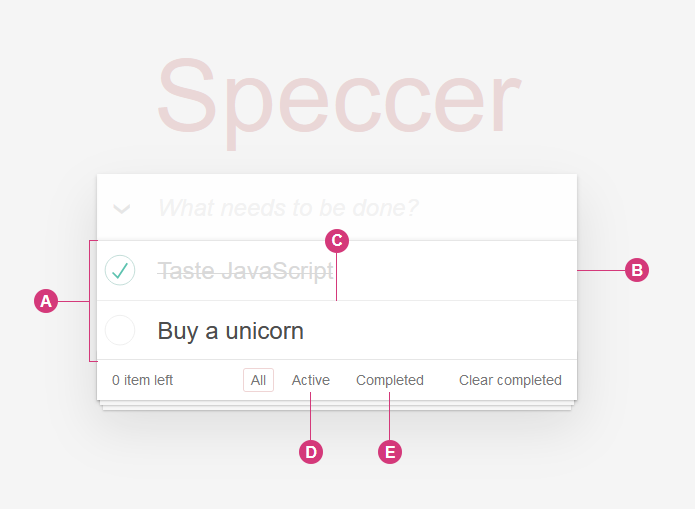

# speccer

> A script to show specifications on html elements in your styleguide

Speccer was created to make it easier to document components in a style guide.

    $ npm i @phun-ky/speccer

See demo here: https://codepen.io/phun-ky/pen/xaOrYX


## Usage

Either import and run the required functions:

```javascript
import { speccer } from '@phun-ky/speccer/src/index.js';

// do stuff
speccer();
```

Or place these `script` and `link` tags in your web page:

```html
<link rel="stylesheet" href="../path/to/speccer.css" />
<script src="../path/to/speccer.js"></script>
```

And then follow the steps below to display the specifications you want :)

If you use React, you can use an effect like this:

```javascript
import React, { useEffect } from 'react';
import PropTypes from 'prop-types';

import debounce from './lib/debounce';
import '@phun-ky/speccer/speccer.css';

const Component = () => {
  let speccerEventFunc;

  useEffect(() => {
    import('@phun-ky/speccer/src/index.js').then(speccerScript => {
      console.info('[@phun-ky/speccer]: Activated speccer ');

      const { speccer } = speccerScript;
      speccer();

      speccerEventFunc = debounce(function () {
        console.info('[@phun-ky/speccer]: Event resize triggered');
        speccer();
      }, 300);

      window.addEventListener('resize', speccerEventFunc);
    });
  });

  useEffect(() => {
    return () => {
      window.removeEventListener('resize', speccerEventFunc);
    };
  }, []);

  return <div />;
};

export default Component;
```

### Element spacing


In your component examples, use the following attribute:

```html
<div data-speccer class="..."></div>
```

This will display the element <em>and all of it's children</em> padding and margin.

### Element dimensions


In your component examples, use the following attribute:

```html
<div data-speccer-measure="[height right|left] | [width top|bottom]" class="..."></div>
```

Where `height` and `width` comes with placement flags. Default for `height` is `left`, default for `width` is `top`.

### Highlight the anatomy of an element



In your component examples, use the following attribute. Remember to use the `data-anatomy-section` as an attribute on a parent element to scope the marking.

```html
<div data-anatomy-section>
  <div data-anatomy="outline [full|enclose] [left|right|top|bottom]" class="..."></div>
</div>
```

This will place a pin to the outline of the element. Default is `top`.

### Element typogpraphy


In your component examples, use the following attribute.

```html
<div data-speccer-typography="[left|right|top|bottom]" class="...">Some text</div>
```

This will place a box to display typography information. Default is `left`.

## Advanced usage

If you want to control speccer a bit more, you have some options. Apply one of these attributes to the script element for different types of initialization:

```html
<script src="../speccer.js" data-<manual|instant|dom|lazy></script>
```

| Tag            | Description                                                         |
| -------------- | ------------------------------------------------------------------- |
| `data-manual`  | Makes `window.speccer()` available to be used when you feel like it |
| `data-instant` | fires off `speccer()` right away                                    |
| `data-dom`     | Waits for `DOMContentLoaded`                                        |
| `data-lazy`    | Lazy loads `speccer()` per specced element                          |

If no attribute is applied, it will default to `data-dom`, as in, it will initialize when `DOMContentLoaded` is fired.

### Lazy

If you're importing speccer instead of with a script tag, you can use the following approach to apply lazy loading:

```javascript
import * as Dissect from '@phun-ky/speccer/src/dissect.js';

let dissectElementObserver = new IntersectionObserver((entries, observer) => {
  entries.forEach(entry => {
    const targets = entry.target.querySelectorAll('[data-anatomy]');
    if (entry.intersectionRatio > 0) {
      targets.forEach(Dissect.element);
      observer.unobserve(entry.target);
    }
  });
});

document.querySelectorAll('[data-anatomy-section]').forEach(el => {
  dissectElementObserver.observe(el);
});
```
